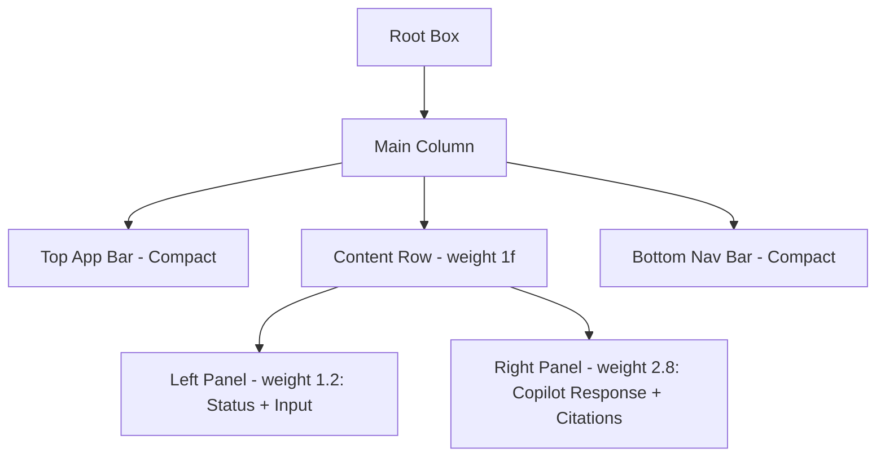

# Implementation Plan - Optimize UI for 1024x768 Resolution

The user reports that the UI is losing features on a 1024x768 display because the screen is "longer (wider) and narrower (shorter)". This is likely due to the limited vertical space (768px height) being consumed by fixed-height elements (Top Bar, Status Card, Input Bar, Bottom Nav), leaving almost no space for the main content (AI Response area).

## Proposed Changes

### [Component] Cockpit UI Layout Optimization

#### [MODIFY] [MainActivity.kt](file:///D:/Hackathon/cockpit-ui/app/src/main/java/com/wheelchair/cockpit/MainActivity.kt)

1.  **Reduce Vertical Footprint**: Shrink the heights of the Top Bar, Status Card, and Input Bar.
2.  **Landscape-First Layout**: Use a `Row` to split the screen into two main areas when vertical space is tight.
    -   **Left Column**: Compact Assistant Status + Manual Input.
    -   **Right Column**: AI Response and Citations (Primary content).
3.  **Compact Components**:
    -   Combine "Hey Car" and "Talk" buttons into a single row or use smaller icons.
    -   Reduce padding and font sizes slightly to fit more content.
4.  **Flexible Content**: Ensure the AI Response area can scroll if it exceeds the remaining height.

### Detailed UI Structure Change:

## Verification Plan

### Automated Tests
- Update `CockpitUIPreview` to use 1024x768 and verify the layout in the preview.
- Ensure all buttons and text fields remain functional.

### Manual Verification
- Ask the user to verify on their 1024x768 device/emulator.
- Check that the AI response is now clearly visible and not crushed.
